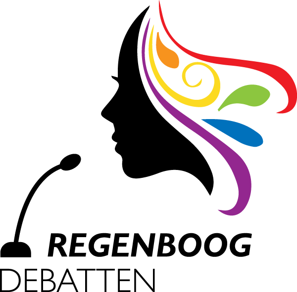

Op 26 en 27 februari organiseerde DWH de **Regenboog Debatten** in aanloop naar de gemeenteraadsverkiezingen. In zes livestreams gingen de kandidaten uit een gemeente in Delfland met elkaar in debat over LHBTI+ onderwerpen zoals queer voorlichting op scholen, inclusiviteit in de sport en ondersteuning van ontmoetingsplaatsen.

Wil jij weten wat de partijen in jouw gemeente voor je kunnen betekenen? Kijk hieronder het debat terug uit jouw gemeente.

| Gemeente           | Dag      | Tijdstip  | Livestream                                       |
| :----------------- | :------- | --------: | :----------------------------------------------- |
| Midden-Delfland    | Zaterdag | 12:00     | [Kijk via YouTube](https://youtu.be/jYXtqQvRzd0) |
| Pijnacker-Nootdorp | Zaterdag | 15:00     | [Kijk via YouTube](https://youtu.be/70IjYll_FNg) |
| Delft              | Zaterdag | 20:00     | [Kijk via YouTube](https://youtu.be/Koj8IgGK2s0) |
| Rijswijk           | Zondag   | 12:00     | [Kijk via YouTube](https://youtu.be/_4-Y_waMkgk) |
| Westland           | Zondag   | 15:00     | [Kijk via YouTube](https://youtu.be/CjX-gdkrJJY) |
| Den Haag           | Zondag   | 20:00     | [Kijk via YouTube](https://youtu.be/V5t6sioAYhQ) |
